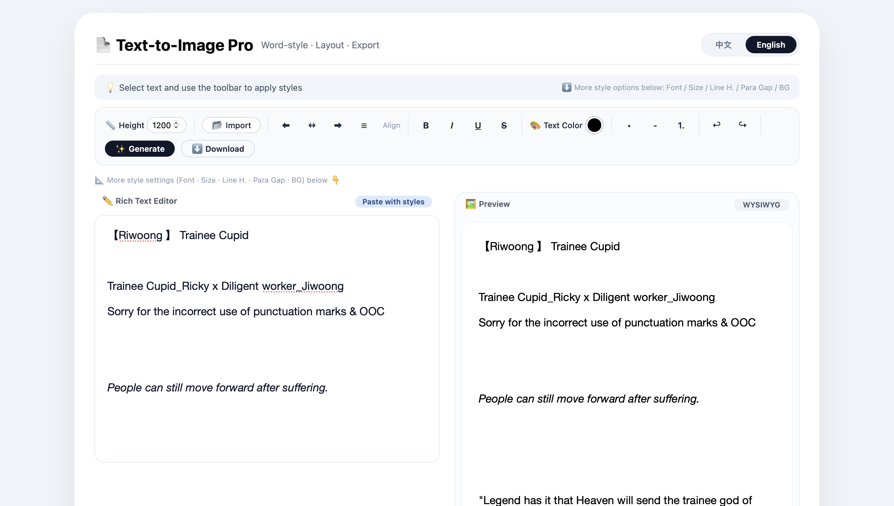
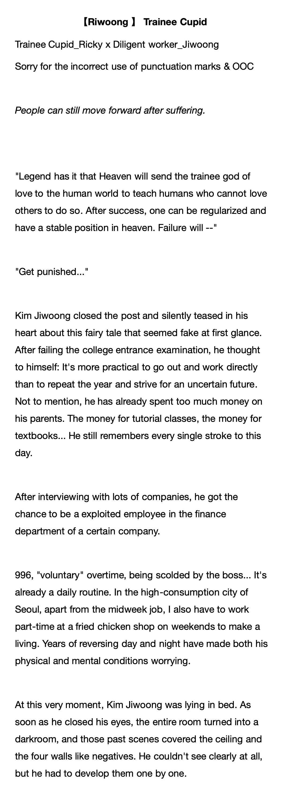

# 📄 Long Image Generator Pro

🌐 Language: **English** | [简体中文](README_zh.md)

A browser-based rich text editor for generating high-quality long images.

No installation required. Simply open the HTML file in your browser and start editing.

---

## About

Long Image Generator Pro is a personal side project developed to solve a real-world need for creating and sharing long-form content.

Originally inspired by writing fanfiction and organizing study notes, the project has gradually evolved into a browser-based rich text editor that supports flexible formatting and high-quality long image export.

The goal is to provide a simple, lightweight, and easy-to-use tool for anyone who wants to share long-form text in image format without relying on desktop software.

---

## 📌 Notice

This project is a personal project created for learning, communication, portfolio display, and archival purposes.

The source code is shared for reference only.

Commercial use, redistribution, or incorporation into commercial products without prior permission from the author is not permitted.

The sample texts and screenshots used in this repository are original works by the author and are not included in any software license.

---

## Features

- Rich text editor
- Import TXT / DOC / DOCX / PDF
- Word-style editing
- Text alignment (Left / Center / Right / Justify)
- Font customization
- Font size adjustment
- Line spacing adjustment
- Paragraph spacing adjustment
- Text color customization
- Multiple background presets
- Custom background color
- Adjustable export height
- Real-time preview
- Export high-resolution PNG images
- English / Chinese interface

---

## Screenshot

The sample text shown in the screenshots is an original fanfiction excerpt written by the author and is used solely for demonstrating the editor and layout features.


### 📝 Editor

<p align="center">
    
</p>

The main editor interface with rich text editing features.

---

### 🖼 Export Result

<p align="center">
    
</p>

Example of a generated long image exported from the editor.


---

## Usage

1. Download the project.

2. Open

```
index.html
```

in any modern browser.

3. Edit your text.

4. Click **Generate**.

5. Export your long image.

---

## Technologies

- HTML5
- CSS3
- Vanilla JavaScript
- html2canvas
- PDF.js
- Mammoth.js

---

## Project Structure

```
Long-Image-Generator-pro/
│
├── index.html
├── README.md
├── README_zh.md
└── image/
    ├── editor.png
    ├── export.png
    ├── editor_zh.png
    └── export_zh.png
```

---

## Roadmap

- Support image insertion
- Support tables
- More built-in templates
- Dark mode
- Better mobile support

---

## License

All Rights Reserved
