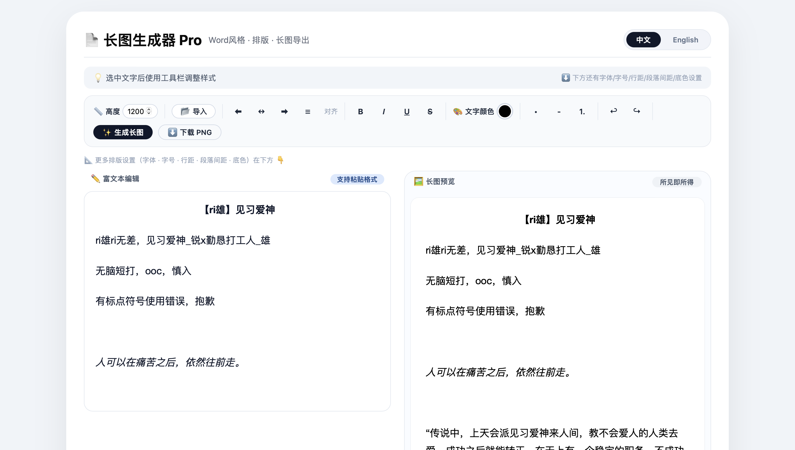
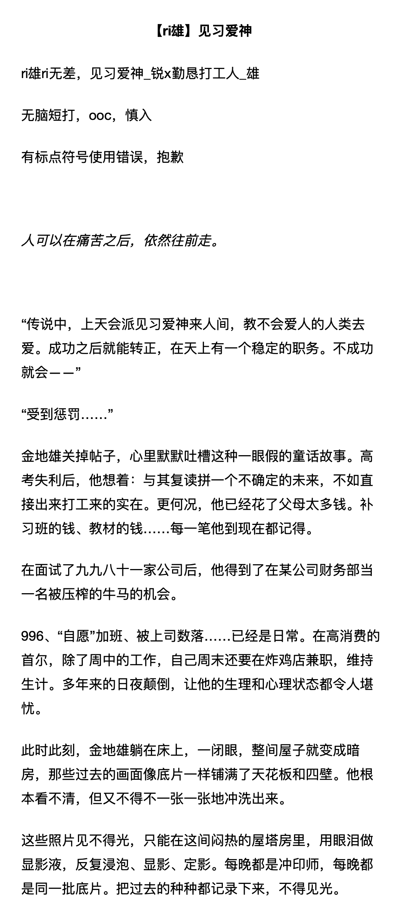

# 📄 长图生成器 Pro

🌐 语言：**简体中文** | [English](README.md)

一个基于浏览器的富文本长图生成工具。

无需安装任何软件，打开网页即可编辑、排版并导出高清长图。

项目 URL: https://kellyfu728.github.io/Long-Image-Generator-pro/

---

## 项目介绍

长图生成器 Pro 是我基于个人实际需求开发的一个小工具。

最初，它主要用于分享同人文、整理学习笔记等长文本内容。随着不断完善，它逐渐发展为一个支持富文本编辑、灵活排版以及高清长图导出的浏览器工具。

我希望它能够提供一个简单、轻量、无需安装软件的解决方案，让用户能够更加方便地编辑和分享长文本内容。

---

## 📌 声明

本项目为作者开发的个人项目，仅用于学习交流、作品展示及存档。

仓库中的源码仅供参考学习。

未经作者许可，不得将本项目用于商业用途，不得转载、分发或整合至商业产品。

仓库中的示例文本、截图等内容均为作者原创，不属于软件授权范围。

---

## 功能特点

- 富文本编辑
- 支持导入 TXT / DOC / DOCX / PDF
- Word 风格排版
- 左对齐 / 居中 / 右对齐 / 两端对齐
- 自定义字体
- 自定义字号
- 行距调整
- 段落间距调整
- 自定义文字颜色
- 多种背景颜色
- 自定义背景颜色
- 自定义导出高度
- 实时预览
- 高清 PNG 导出
- 中英文双语界面

---

## 项目截图

截图中的示例文本为作者原创同人文片段，仅用于展示编辑器排版及长图导出效果。


### 📝 编辑器界面

<p align="center">
    
</p>

长图生成器的编辑器界面，可进行富文本编辑与排版。

---

### 🖼 导出效果

<p align="center">
    
</p>

由编辑器导出的长图效果示例。


---

## 使用方法

1. 下载项目。

2. 双击打开

```
index.html
```

3. 编辑文本内容。

4. 点击 **生成长图**。

5. 点击 **下载 PNG** 即可导出图片。

---

## 技术栈

- HTML5
- CSS3
- 原生 JavaScript（Vanilla JavaScript）
- html2canvas
- PDF.js
- Mammoth.js

---

## 项目结构

```
Long-Image-Generator-pro/
│
├── index.html
├── README.md
├── README_zh.md
└── image/
    ├── editor.png
    ├── export.png
    ├── editor_zh.png
    └── export_zh.png
```

---

## 后续计划

- 支持插入图片
- 支持表格
- 提供更多排版模板
- 深色模式
- 更好的移动端适配

---

## 开源协议

保留所有权利

All Rights Reserved

